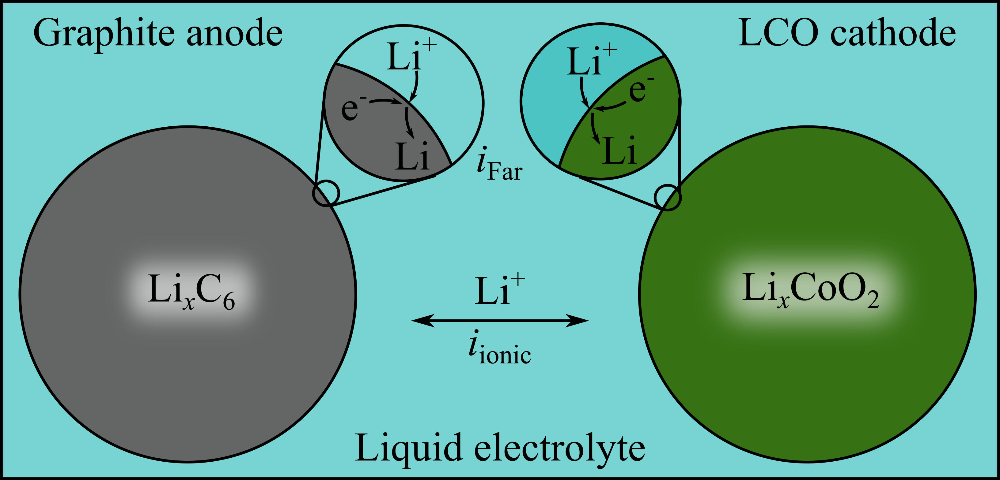

# cantera-jupyter

[Cantera](https://cantera.org) examples in the form of [Jupyter](https://jupyter.org)
notebooks. To see the rendered notebooks, browse the directories above or visit the
links in the list of examples below. If you want to execute the examples on your
own computer, please see the installation instructions [below](#installation-instructions).
If you would only like to run the examples in the cloud, click the MyBinder
link below (note that your changes on MyBinder won't be saved unless you download
the changed files from there).

[](https://mybinder.org:/repo/cantera/cantera-jupyter)

## Examples

<table align="center">

<tr align="center">
<td>  <br> Freely Propagating Flame  </td>
<td>  <br> Strained Flames </td>
</tr>

<tr align="center">
<td>  <br> Continuous Stirred Tank Reactor </td>
<td>  <br> Batch Reactor </td>
</tr>

<tr align="center">
<td>  <br> Li+ Battery OCV Calculation</td>
</tr>

</table>

* Basic Thermodynamics Calculations
  * [Fuel heating value calculator](https://github.com/Cantera/cantera-jupyter/blob/main/thermo/heating_value.ipynb)
  * [Equilibrium flame temperature calculator](https://github.com/Cantera/cantera-jupyter/blob/main/thermo/flame_temperature.ipynb)
  * [Equation of State Comparison: Ideal, Redlich-Kwong, and Helmholtz Energy](https://github.com/Cantera/cantera-jupyter/blob/main/thermo/equations_of_state.ipynb)

* Flame Simulations
  * [Flame speed calculator with sensitivity analysis](https://github.com/Cantera/cantera-jupyter/blob/main/flames/flame_speed_with_sensitivity_analysis.ipynb)
  * [Flame speed calculator with grid convergence analysis](https://github.com/Cantera/cantera-jupyter/blob/main/flames/flame_speed_with_convergence_analysis.ipynb)
  * [Counter-flow twin premixed flame simulator](https://github.com/Cantera/cantera-jupyter/blob/main/flames/twin_premixed_flame_axisymmetric.ipynb)

* Reactor Models
  * [Batch Reactors: Illustration of ignition delay calculation](https://github.com/Cantera/cantera-jupyter/blob/main/reactors/batch_reactor_ignition_delay_NTC.ipynb)
  * [Batch reactors with non-ideal gases](https://github.com/Cantera/cantera-jupyter/blob/main/reactors/NonIdealShockTube.ipynb)
  * [Continuous Reactors: Simulations at a given residence time](https://github.com/Cantera/cantera-jupyter/blob/main/reactors/stirred_reactor.ipynb)

* Electrochemistry
  * [Open circuit voltage calculations in a Lithium ion battery](https://github.com/Cantera/cantera-jupyter/blob/main/electrochemistry/lithium_ion_battery.ipynb)

## Installation Instructions

### 1. Install Cantera

If you don't already have Cantera installed, refer to the instructions on
the [Cantera website](https://cantera.org/install/index.html).

### 2. Install Jupyter Notebook

If you used Conda to install Cantera (the recommended method), you will
need to install Jupyter Lab into the same environment where you
installed Cantera.

1. Activate the environment with the Cantera package (called `cantera` here):

   ```shell
   conda activate cantera
   ```

2. Install Jupyter Notebook into that environment

   ```shell
   conda install jupyterlab
   ```

3. Run Jupyter Lab, which will open a browser window

   ```shell
   jupyter lab
   ```

Otherwise, use `pip` to install the Jupyter Notebook:

```shell
python -m pip install jupyterlab
```

### 3. Download the Cantera Jupyter Examples

**Option 1:** Download the zip file from [GitHub](https://github.com/Cantera/cantera-jupyter/archive/main.zip)
and extract it to a convenient location on your computer.

**Option 2:** Use Git to clone this repository to a convenient location on your computer

```shell
git clone https://github.com/Cantera/cantera-jupyter.git
```

## Code of Conduct

This repository follows the same code of conduct as the main Cantera repository.
Cantera adheres to a [code of conduct](https://github.com/Cantera/cantera/blob/main/CODE_OF_CONDUCT.md)
adapted from the [Contributor Covenant code of conduct](https://contributor-covenant.org/).

## Frequently Asked Questions

**How do I use Cantera with Python?**

An introduction to the Cantera Python interface is available
[here](https://cantera.org/tutorials/python-tutorial.html). For more
advanced uses of Cantera, the complete documentation can be found
[here](https://cantera.org/documentation/index.html).

**Can I forgo installing Cantera locally and just use Cantera in the cloud every
time?**

The problem with using Cantera with MyBinder is that there is no way for you to
save your work. You can upload/download files in a session, but once the session
is over (you close your browser window), you lose all your work. You thus cannot
save your modified Jupyter notebooks.

**I still can't figure something out. Who do I ask?**

If you have more questions, need help with something, or have any suggestions,
please visit the
[Cantera Google Groups Page](https://groups.google.com/forum/#!forum/cantera-users)
and create a post.
