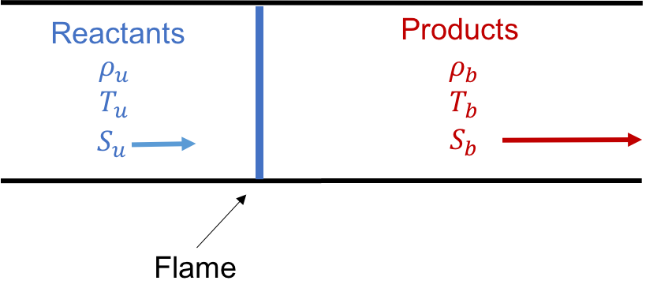

# cantera-jupyter

[Cantera](https://cantera.org) examples in the form of [Jupyter](http://jupyter.org)
notebooks. To see the rendered notebooks, browse the directories above or visit the
links in the list of examples below.

**Existing Cantera users**: If you have [Cantera](https://cantera.org) and
[Jupyter](http://jupyter.org) installed on your local machine, simply download
any Jupyter notebook and you should be able to run it.

**New Cantera Users**: If you don't have an exiting Cantera installation, you
can either
[download and install Cantera](https://cantera.org/install/index.html)
or give Cantera a test drive in the cloud. Click on the Binder link below to
launch an interactive environment where you can run these examples. For this,
there is no installation required.

## Examples

<table align="center">

<tr align="center">
<td>    Freely Propagating Flame  </td>
<td>    Strained Flames </td>
</tr>

<tr align="center">
<td>    Continuous Stirred Tank Reactor </td>
<td>    Batch Reactor </td>
</tr>

</table>

* Basic Thermodynamics Calculations
  * [Fuel heating value calculator](https://github.com/Cantera/cantera-jupyter/blob/master/thermo/heating_value.ipynb)
  * [Equilibrium flame temperature calculator](https://github.com/Cantera/cantera-jupyter/blob/master/thermo/flame_temperature.ipynb)

* Flame Simulations
  * [Flame speed calculator with sensitivity analysis](https://github.com/Cantera/cantera-jupyter/blob/master/flames/flame_speed_with_sensitivity_analysis.ipynb)
  * [Counter-flow twin premixed flame simulator](https://github.com/Cantera/cantera-jupyter/blob/master/flames/twin_premixed_flame_axisymmetric.ipynb)

* Reactor Models
  * [Batch Reactors: Illustration of ignition delay calculation](https://github.com/Cantera/cantera-jupyter/blob/master/reactors/batch_reactor_ignition_delay_NTC.ipynb)
  * [Continuous Reactors: Simulations at a given residence time](https://github.com/Cantera/cantera-jupyter/blob/master/reactors/stirred_reactor.ipynb)

## Code of Conduct

This repository follows the same code of conduct as the main Cantera repository.
Cantera adheres to a [code of conduct](https://github.com/Cantera/cantera/blob/master/CODE_OF_CONDUCT.md)
adapted from the [Contributor Covenant code of conduct](https://contributor-covenant.org/).

## Frequently Asked Questions

**How do I use Cantera with Python?**

An introduction to the Cantera Python interface is available
[here](https://cantera.org/tutorials/python-tutorial.html). For more
advanced uses of Cantera, the complete documentation can be found
[here](https://cantera.org/documentation/index.html).

**Can I forgo installing Cantera locally and just use Cantera in the cloud every
time?**

The problem with using Cantera with Binder is that there is no way for you to
save your work. You can upload/download files in a session, but once the session
is over (you close your browser window), you lose all your work. You thus cannot
save your modified Jupyter notebooks.

**I still can't figure something out. Who do I ask?**

If you have more questions, need help with something, or have any suggestions,
please visit the
[Cantera Google Groups Page](https://groups.google.com/forum/#!forum/cantera-users)
and create a post.
